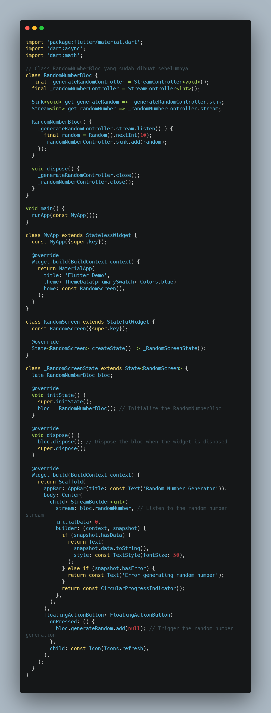

# bloc_random_tyase

## Praktikum 7: BLoC Pattern

### Langkah 1: Buat Project baru

### Langkah 2: Isi kode random_bloc.dart

### Langkah 3: Buat class RandomNumberBloc()

### Langkah 4: Buat variabel StreamController

### Langkah 5: Buat constructor

### Langkah 6: Buat method dispose()

### Langkah 7: Edit main.dart

### Langkah 8: Buat file baru random_screen.dart

### Langkah 9: Lakukan impor material dan random_bloc.dart

### Langkah 10: Buat StatefulWidget RandomScreen

### Langkah 11: Buat variabel

### Langkah 12: Buat method dispose()

### Langkah 13: Edit method build()

**Soal 13**

1. Jelaskan maksud praktikum ini ! Dimanakah letak konsep pola BLoC-nya ?

   Konsep BLoC-nya terletak pada:

   Logika bisnis di random_bloc.dart, yang menggunakan StreamController untuk menerima event (melalui Sink<void>) dan mengirimkan data (melalui Stream<int>).
   UI di RandomScreen, yang menggunakan StreamBuilder untuk mendengarkan dan merender data dari Stream.
   Pemisahan ini menciptakan alur data satu arah: event dari UI → diproses di BLoC → hasil dikirim kembali ke UI. Hal ini membuat aplikasi lebih modular, mudah diuji, dan dipelihara.

Capture hasil praktikum Anda berupa GIF dan lampirkan di README.

Lalu lakukan commit dengan pesan "W12: Jawaban Soal 13".
